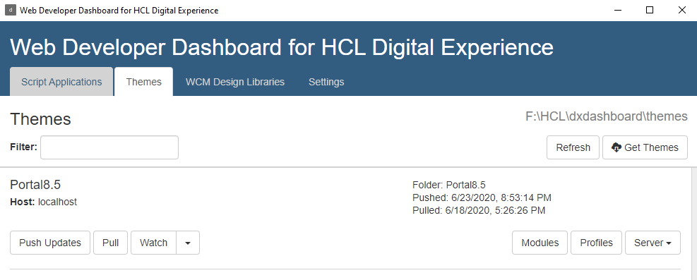
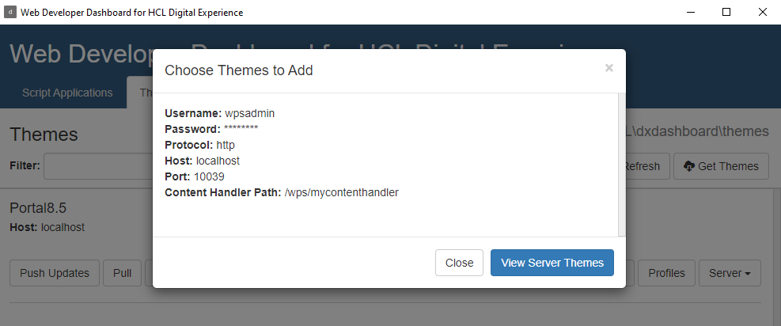
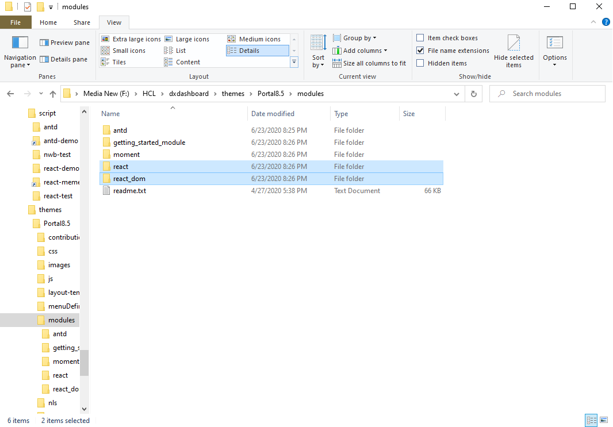
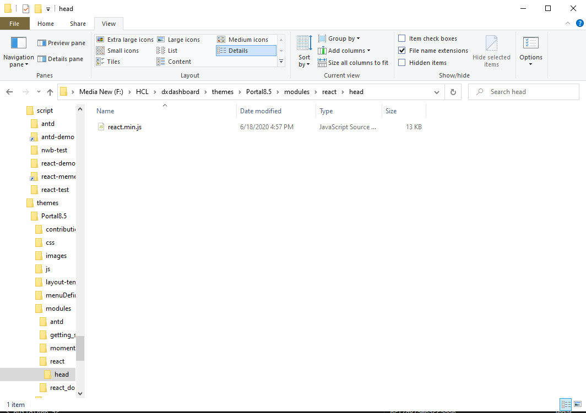
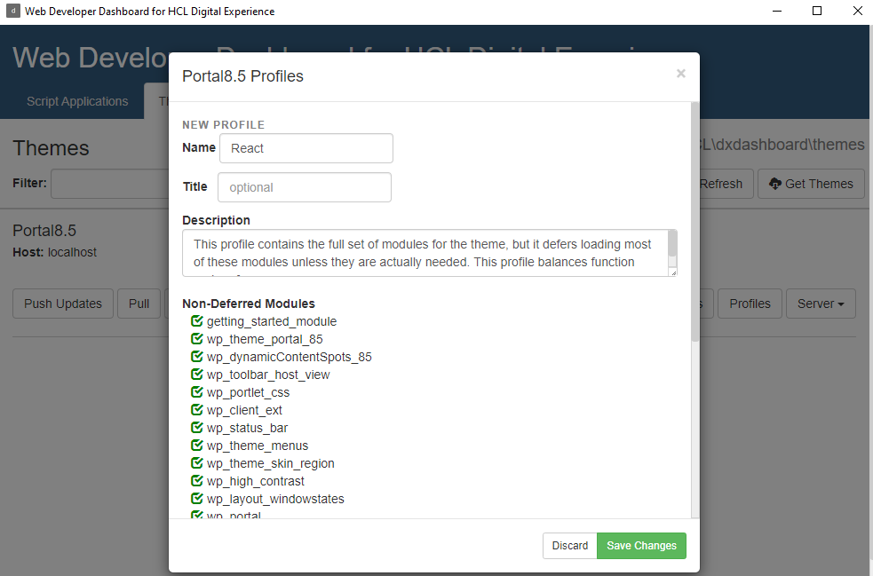

# PRE CF201 Steps

### Webpack
Please do not set the `collapseWhitespace` to `false` in your webpack minify configuration. There is an issue with the importer expecting a carriage return at the end of the html document and if it is not present, it will place the <htmlwrapper> incorrectly, hiding the React component output.

### Settings needed
Turn off dynamic parameter tag and shortform in DX since they may interfere with some of the syntax you will use with React. 
- Go to the Websphere Application Server Integrated Solution Console at https://localhost:10041/ibm/console
- Set (or create) both the dynamic.parameter.tag.enabled and the renderingplugin.shortform.enabled resource environment provider values of the WCM WCMConfigService service to false in the HCL Digital Experience Integrated Solutions Console.
- Use the configuration task ConfigEngine.sh|bat enable-wcm-spa-script-app-properties - for details see doc: [here](https://help.hcltechsw.com/digital-experience/8.5/script-portlet/script_app_improvements.html?hl=react#script_app_improvements__section_mhm_pzw_3sb)
- Make sure to restart the WebSphere_Portal server after these updates.

### <a name='add-react'>Add</a> React and ReactDOM to the theme you want to use
 
Here we will use the default Portal 8.5 Theme.

If deploying before CF201 or when deploying into your own theme:

    - In the DX Web Developer Dashboard go to Themes and hit Get Themes. (The images show an already configured setup) 
    

    - You may see a screen with a **_Get Server Themes option_**, click that button.

    - The Dashboard will show you all themes on the server you may use. Supply a name for the folder where you want to store the theme assets in under the Portal 8.5 theme.

    - Click **_Create Theme Folders_** 
    - The dashboard will now pull all the theme assets to the folder you specified.
    - Go to the theme folder and into the **_modules_** sub folder
    - Create two new folders in the **_modules_** sub folder named **_react_** and **_react_dom_**

    - Within each of the new folders, create a head folder.
    - Download the React and ReactDom minified javascript files and copy them into the respective head folders. (For development/debug, use the non minifed js files)

    - Create a file named **_prereqs.properties_** in the **_react_dom_** folder and add **_react_** as a dependency. 
    **_Make sure that the name matches the module providing react._**

    VS Code:

    - Go back to the dashboard and go to Themes and click the Profiles button for the Portal 8.5 theme.

    - Copy the **_Deferred_** profile, name it **_React_** and add the **_react_** and **_react_dom_** modules.

    - Save your change and push the updates to the theme to the server.
