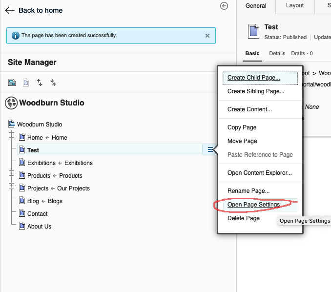
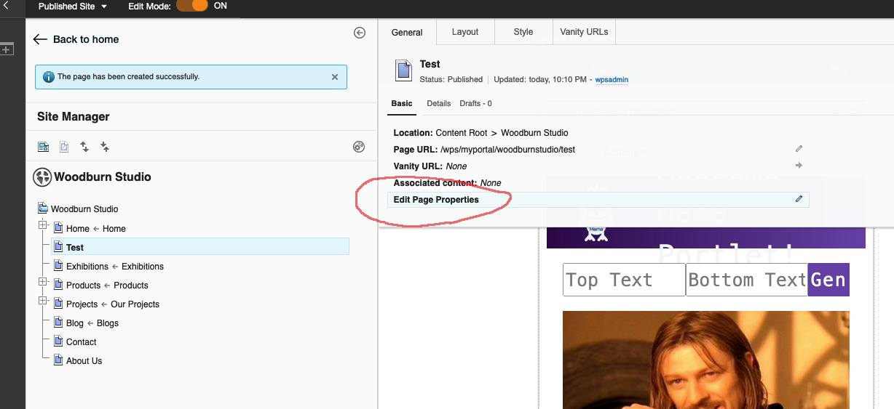
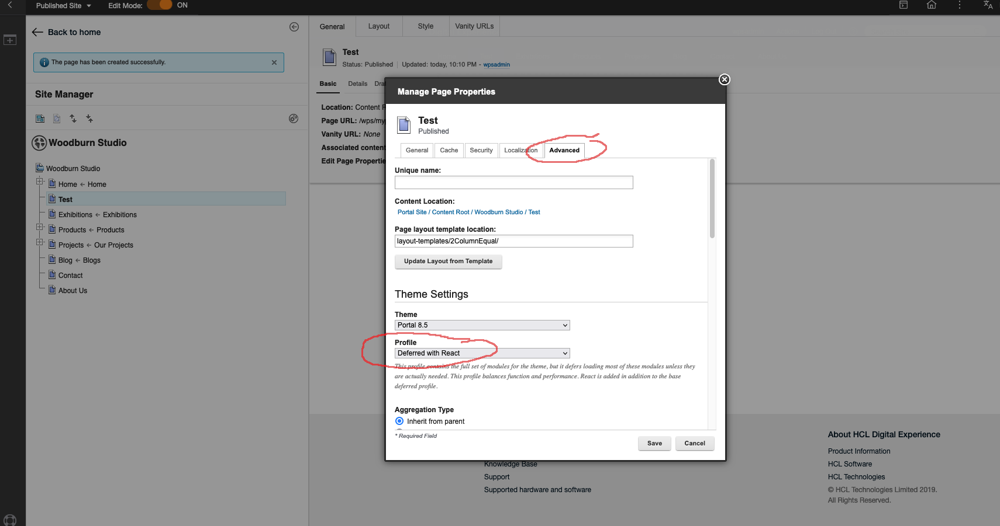
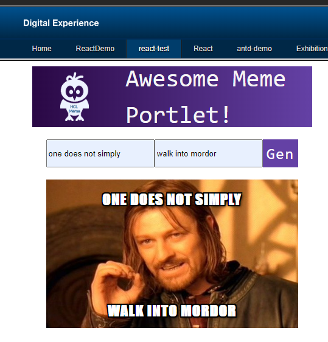

# HCL DX React Script App Example

## Overview
This example app shows how React can be used in Script App portlets. It uses DX modular themes aggregator capability to provide React and ReactDOM.

You can also run React inside a WCM component using Babel ([see here](./babel-standalone.md)) or pre-transpiled code. Using @babel/standalone is not recommended for production deployments (see: https://babeljs.io/docs/en/babel-standalone). 

For more information on how to build and deploy DX Script Apps, see the following links:

- [Script Application Section in the official HCL DX documentation](https://help.hcltechsw.com/digital-experience/8.5/script-portlet/script_portlet.html)
- [HCL Webinar for the Script Application](https://register.gotowebinar.com/register/7426671489876419343)

Webpack is used to package the React components and create a build folder. The example uses Windows [symbolic links](https://en.wikipedia.org/wiki/Symbolic_link) to map the build folder to the Web Developer Dashboard. This would be the same approach on Linux or MacOS using [_ln_](https://man7.org/linux/man-pages/man1/ln.1.html) instead of [_mklink_](https://docs.microsoft.com/en-us/windows-server/administration/windows-commands/mklink).

The project structure is as follows:

- **build**
    - _Output folder. Symlinked to the Web Deveopler Dashboard script folder location._
- **src**
    - **assets**
        - _Images etc._
    - **css**
        - _CSS Files_
    - **components**
        - _React Components_
    - sp-config.json < _HCL DX Web Developer Dashboard configuration_
    - vendor.js < _Load 3rd party libraries here_

Run `npm start` to start a local Webpack dev server. Alternatively you can use the run option in the HCL DX Web Developer Dashboard.

Run `npm run build` to build to the build folder. If the folder is linked into the script folder of the Dashoard and watch is enabled on the folder in the Dashboard, changes will be pushed into the configured DX server automatically. 

The example uses the HCL DX 9.5 docker container but any DX instance can be used. 

## Caution

Before version 201 there were some issues that have since been addressed as well as needing to add React and React Dom to your theme manually. 

If you would like to add your own React files or need instructions for environments before CF 201 please review this document: [PRE-CF201.md](PRE-CF201.md)

## Setup

1. If you want to install a local DX docker container to run against, see the instructions [here](./docker.md).

2. Install [Node.js](https://nodejs.org/en/download/). See the version requirements for the DX Developer Dashboard.

3. Install the DX Web Developer Dashboard and point it to the DX server you want to deploy to, if you do not have done so already. See instructions [here](./dxwebdashboard.md).
Alternatively you can also use sp push application or dxclient. 

6. Clone this project somewhere on your drive
7. Run npm install at the root of the project to install Babel and its dependencies. *You may need to run `npm install --legacy-peer-deps` and `npx -p npm@6 npm audit fix `* to install the dependencies.
8. Create a symbolic link to the build folder from the scripts directory
    
    **_Linux / MAC OS_**
    - ln  -s /_my_react_sample_app_folder_/sample-react-script-application/build /_my_DX_Web_Dev_Dashboard_folder_/DX/script/build

    **_Windows:_**
    - Click the Start button
    - Type CMD in the Start Search box
    - Press and hold down [Ctrl]+[Shift]+[Enter] to start in administrator mode
    - Run the mklink command.
      
      ```mklink /D C:\HCL\dxdashboard\script\react-meme C:\HCL\dxdashboard\dev\react-meme\build```
9. Run `npm run build` to build to the build folder. If the folder is linked into the script folder of the Dashoard and watch is enabled on the folder in the Dashboard, changes will be pushed into the configured DX server automatically. 


11. Upload the script app.

    - In the DX Web Developer Dashboard go to Script Applications and hit refresh. Since you linked the build folder into the scripts folder in step 8, you should now see the react-meme application.
    - Script Applications are stored as content in the CMS, and the sp-config.json file in the src folder configures the DX Web Developer Dashboard appropriately. See the documentation on [command line push support](https://help.hcltechsw.com/digital-experience/8.5/script-portlet/cmd_line_push_cmd.html) for more information.
    - You can now push the application to the server using the push option.

    

Alternatively you can use dxclient to push the script application. For more information see [here](https://help.hcltechsw.com/digital-experience/9.5/containerization/scriptapplications.html#scriptapplications__section_um4_jqg_w4b)

    - Create a new page in DX and choose the `Deferred with React` theme profile that includes React v16 in the advanced page settings. You should see the react-meme application listed under Script Applications. Add it to the page and exit edit mode.






    - Edit the code, click watch in the Web Developer Dashboard and run `npm run build`. If you have watch enabled in the Developer Dashboard, changes will be synchronized to the server.
    
**Notes:**

You can edit the scrip application on the portal server, but since we are  a packager/minifier, you may want to change the webpack.prod.js file before debugging inside DX. Change:

    mode: "production",
    
to
    
    mode: "development",
    devtool: "none",

and remove the `optimization:` section.


## Attribution
The portlet app code is based on the freeCodeCap.org React course on [youTube](https://youtu.be/DLX62G4lc44). Check it out if you are new to React since it gives a great introduction to core React concepts.


