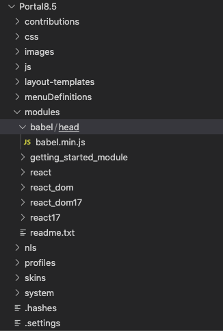
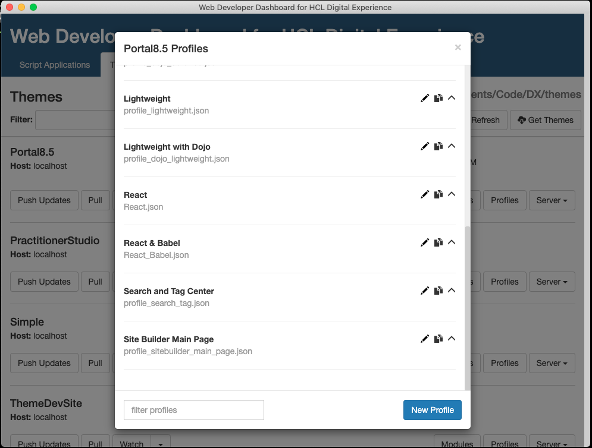
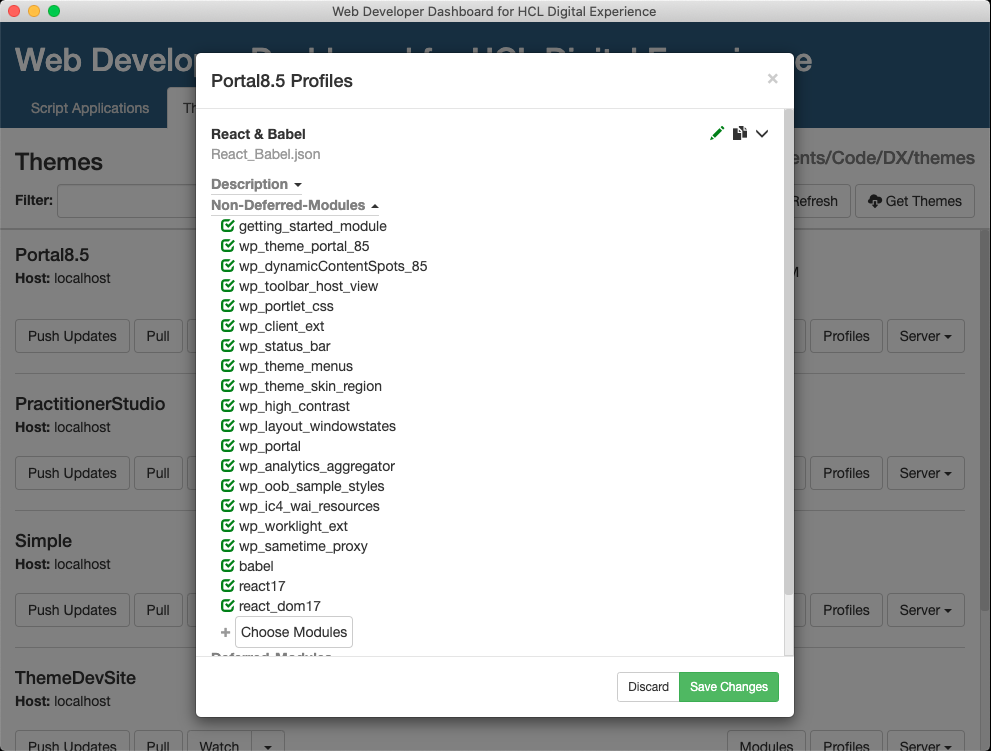
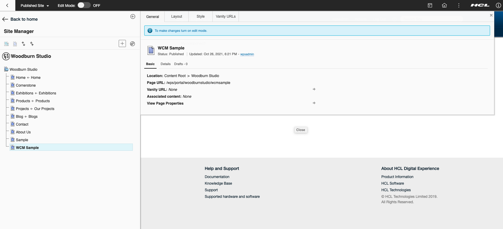
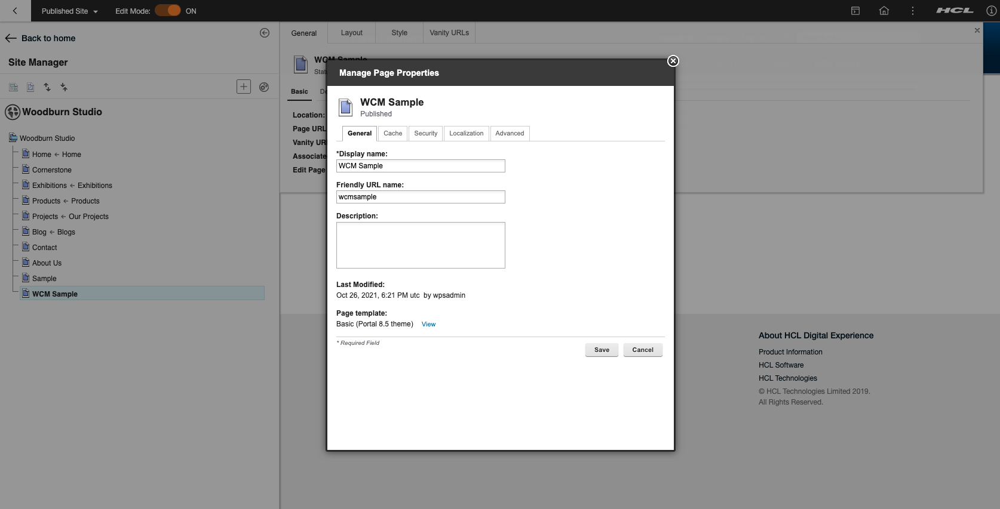
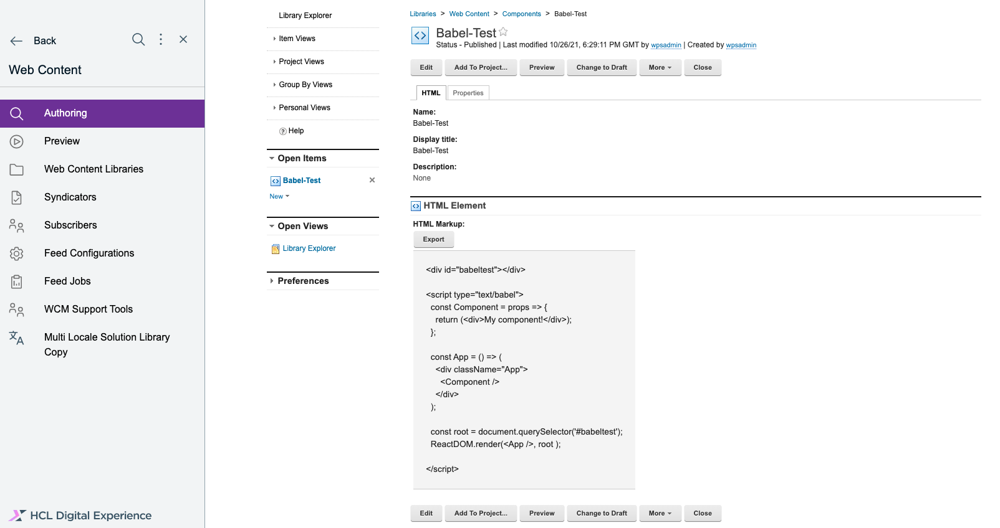
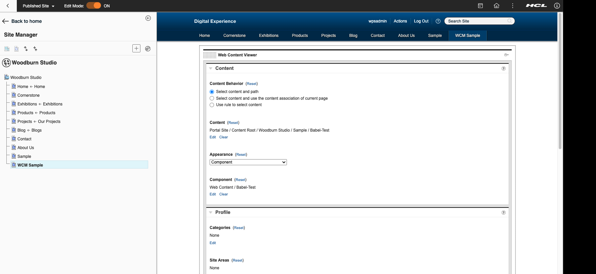
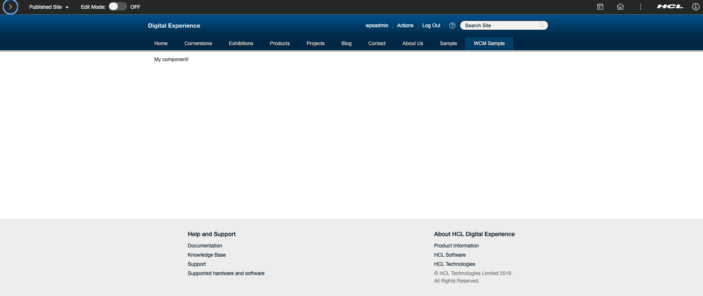

# Running Babel standalone in a WCM component

## Add @babel/standalone to the theme
In addition to [adding React and ReactDOM](./README.md#add-react), we will also need to add babel to the theme so we can use JIT transpiling on the browser.
It is recommended to use Node to pre-compile your React components / JSX. See the [@babel/standalone documentation](https://babeljs.io/docs/en/babel-standalone) for more information.

- Create a new folder for the babel javascript file (Download from https://unpkg.com/@babel/standalone/babel.min.js or https://unpkg.com/@babel/standalone/babel.js) in your theme folder.

    

- Add the module to your React profile (Here I made a separate React-Babel Profile) and push the theme to the server.

        
    
    

- Make a new page on your portal server and associate the new profile.

    
    
    

- Add a new HTML component to WCM, add your code and reference it on the new page.

    
    
    

    
