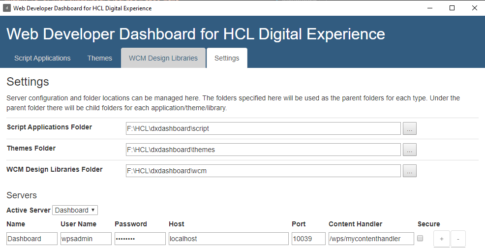

# DX Web Developer Dashboard Setup

1. Install the [DX Web Developer Dashboard](https://github.com/HCL-TECH-SOFTWARE/WebDevToolkitForDx) and it's requirements and run it.
2. Configure script, theme and wcm folders in the settings to somewhere on your drive. I use a folder that includes sub folders for each and point to them.
3. Configure server(s). You can have multiple servers registered, such as, for example, a local dev instance based on the docker image, a remote development server deployed using SoFY and a remote integration server installed using the traditional installation process.

    **_Example:_**

        Name:             Dashboard
        User Name:        wpsadmin
        Password:         wpsadmin
        Host:             localhost
        Port:             10039
        Content Handler:  /wps/mycontenthandler

    

#### Return to the [README.md](./README.md)