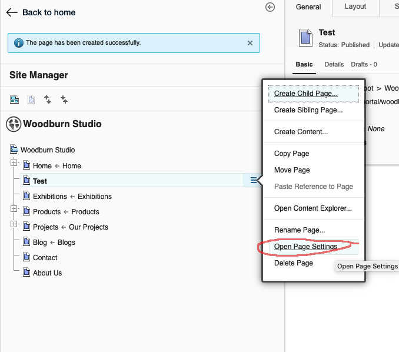
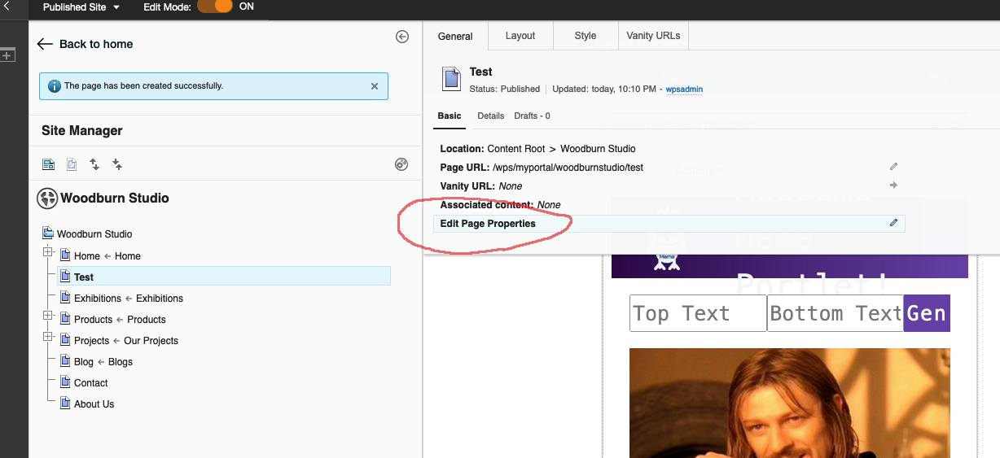
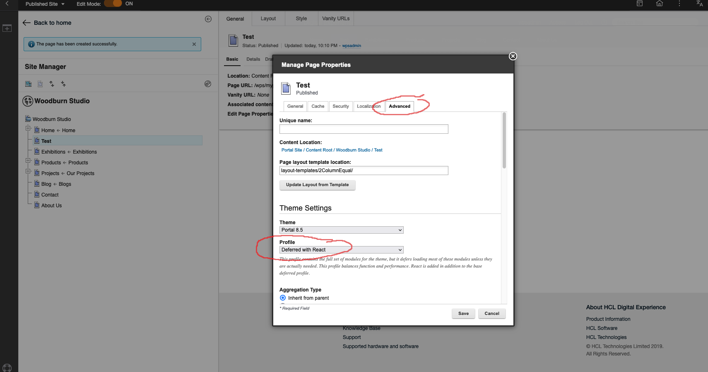
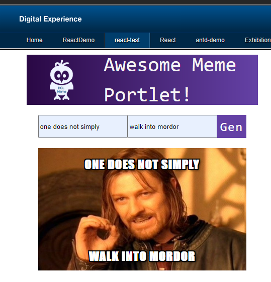

# HCL DX React Script App Example

## Overview

This example app shows how React can be used in Script App portlets.

You can also run React inside a WCM component using Babel ([see here](./babel-standalone.md)) or pre-transpiled code. Using @babel/standalone is not recommended for production deployments (see: https://babeljs.io/docs/en/babel-standalone).

For more information on how to build and deploy DX Script Apps, see the main [README.md](../README.md)

The project structure is as follows:

- **build**
  - _Output folder. This location needs to be pointed to by the dxContentRoot variable in the .dxclient.env file._
- **src**
  - **assets**
    - _Images etc._
  - **css**
    - _CSS Files_
  - **components**
    - _React Components_
  - vendor.js < _Load 3rd party libraries here_

Run `npm start` to start a local Webpack dev server. Alternatively you can use the run option in the HCL DX Web Developer Dashboard.

Run `npm run build` to build to the build folder.

The example uses the HCL DX 9.5 docker container but any DX instance can be used.

## Caution

Before version 201 there were some issues that have since been addressed as well as needing to add React and React Dom to your theme manually.

If you would like to add your own React files or need instructions for environments before CF 201 please review this document: [PRE-CF201.md](PRE-CF201.md)

## Setup

1. Ensure you have run the basic installation steps see the main [README.md](../README.md)

2. Run npm install at the root of the sub project you want to try out to install Babel and its dependencies. _You may need to run `npm install --legacy-peer-deps` and `npx -p npm@6 npm audit fix `_ to install the dependencies.

3. Adjust the dx variables in `.dxclient.env` to your environment (Review the dxContentRoot especially. An example is included for both Windows and Linux/Mac):

```
dxProtocol=http
dxHostName=localhost
dxPort=10039
dxUserName=wpsadmin
dxPassword=wpsadmin
dxContentHandlerPath=/wps/mycontenthandler
dxVirtualPortalContext=
dxProjectContext=
dxMainHtmlFile=index.html
dxSiteArea=Script Application Library/Script Applications/
dxContentName=sampleReactApplication
dxContentTitle=Sample React Script Application
# dxContentRoot=/Users/me/git/sample-react-script-application/build
dxContentRoot=C:\dx\sample-react-script-application\build
verbose=false
```

4. Ensure the following scripts are defined in your `package.json`:

```
  "scripts": {
    "start": "webpack-dev-server --config  webpack.dev.js --open",
    "check-env": "node -e 'console.log(process.env)' | grep npm",
    "build": "webpack --config  webpack.prod.js",
    "dx:deploy": "node dxclient.mjs "
  },
```

5. Run:

   - `npm run start` to run the project in a local lightweight http server
   - `npm run build` to build to the build folder
   - `npm run dx:deploy` to build and deploy the project to your dx server

6. Log into your HCL DX server and create a new page. Choose the `Deferred with React` theme profile that includes React (depending on you CF level this may change or you may provide your [own module](PRE-CF201.md)) in the advanced page settings. You should see the react-meme application listed under Script Applications. Add it to the page and exit edit mode.






7. Edit the code and run `npm run dxdeploy`. Your changes will be uploaded to the server.

**Notes:**

You can edit the scrip application on the portal server, but since we are a packager/minifier, you may want to change the webpack.prod.js file before debugging inside DX. Change:

    mode: "production",

to

    mode: "development",
    devtool: "none",

and remove the `optimization:` section.

## Attribution

The portlet app code is based on the freeCodeCap.org React course on [youTube](https://youtu.be/DLX62G4lc44). Check it out if you are new to React since it gives a great introduction to core React concepts.
